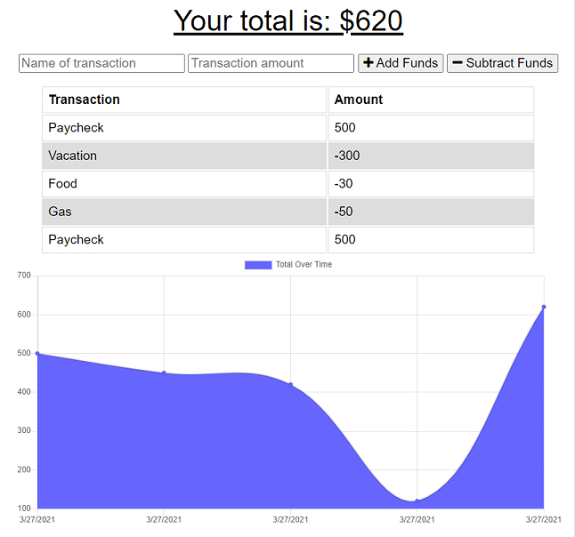

# Budget-Tracker
Budget tracker that gives users a fast and easy way to track their money even while offline.
# Installation

Clone the repositry from GitHub and open using Visual Studio Code.

# Usage 
[Deployed Site](https://rst-budget-tracker.herokuapp.com/)

# Credits

Made by [Russ Tracy]

[express.js](https://www.npmjs.com/package/express)

[mongoose](https://mongoosejs.com/)

# Questions

[Contact Me](russ_tracy@comcast.net)

[GitHub](https://github.com/russtracy)
